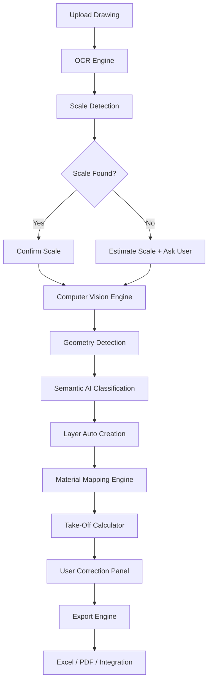
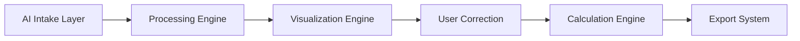
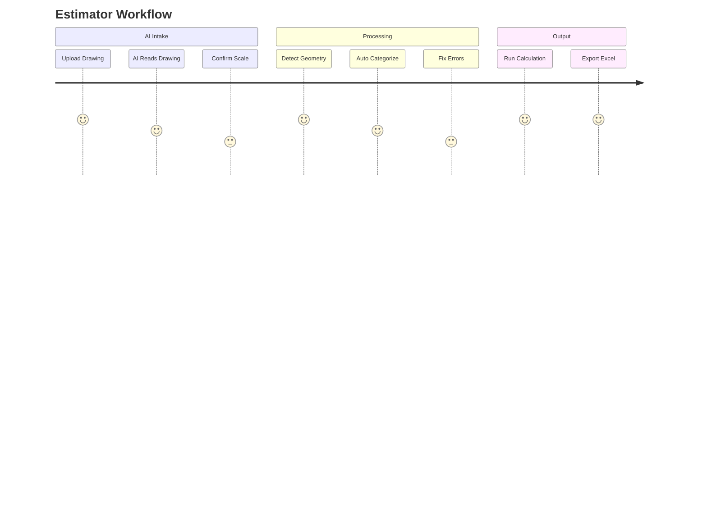

# 🏗️ CoNSoL-TakeOff AI — PRODUCT STORY

---

## 🎯 The Problem

Civil engineers, estimators, and contractors:

- Spend **hours redrawing plans**
- Manually extracting dimensions
- Manually assigning materials
- Re-calculating quantities
- Producing reports manually

👉 This leads to:

❌ Human error  
❌ Time loss  
❌ Cost overruns

---

## 🚀 The Solution

# 🤖 **AI-Powered Take-Off Engine**

---

## 💡 Product Vision

> “Upload a drawing → Get quantities, cost, and reports in minutes.”

## 🧠 System Intelligence Flow

---

## 🧱 System Architecture

---

## 🎯 Core Value Proposition

|Feature|Benefit|
|---|---|
|AI reading drawings|⏱ Save 80% time|
|Auto scale detection|🎯 Accuracy|
|Layer separation|👁️ Clear visualization|
|Material mapping|💰 Instant cost|
|Export reports|📊 Business ready|

---

## 🔥 Key Differentiators

✅ No manual drawing required  
✅ AI-assisted interpretation  
✅ User-controlled correction  
✅ Built for real construction workflow

---

## 💼 Business Impact

- Reduce estimation time from **hours → minutes**
- Improve accuracy across projects
- Enable scalable estimation workflows
- Integrate with project management systems

---

## 👷 Real User Journey

---

