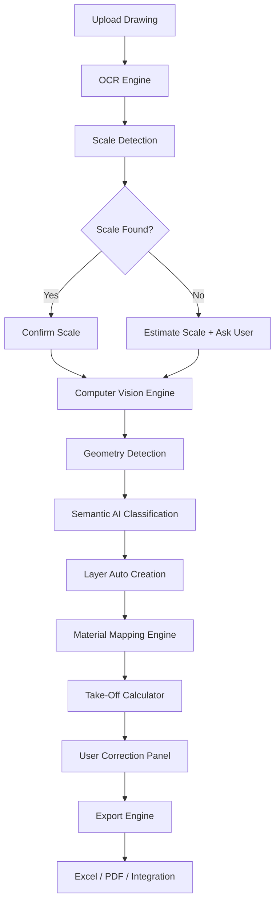
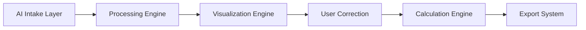

# 🏛 CoNSoL-TakeOff AI — PRODUCT STORY

---

# 🤖 ***AI Product Vision***

## 🔬 Mission

Transform construction drawings into automated take-off results using AI.

## 🎯 The Problem

Civil engineers, estimators, and contractors:

- Spend **hours redrawing plans**
- Manually extracting dimensions
- Manually assigning materials
- Re-calculating quantities
- Producing reports manually

👉 This leads to:

❌ Human error  
❌ Time loss  
❌ Cost overruns

---

## 🚀 The Solution
#  🏛 ***AI-Powered Take-Off Engine***

## 💡 Product Vision

> “Upload a drawing → Get quantities, cost, and reports in minutes.”
## 🧠 System Intelligence Flow

### 📊 Flow

Upload → Detect → Classify → Calculate → Export

---

## 🧱 System Architecture Overview

### 📝 Layers

- AI Intake
- Processing Engine
- Visualization
- User Control
- Export System

---

### 👷 Execution Roadmap

#### Phase 1
- AI Intake
- Scale Detection

#### Phase 2
- Geometry Detection
- Classification

#### Phase 3
- Smart Layers
- Material Mapping
- Cost Management 

#### Phase 4
- Export
- User Corrections

---

## 🎯 Core Value Proposition

| Feature              | Benefit                 |
| -------------------- | ----------------------- |
| AI reading drawings  | ⏱ Save 80% time         |
| Auto scale detection | 🎯 Accuracy             |
| Layer separation     | 👁️ Clear visualization |
| Material mapping     | 💰 Instant cost         |
| Export reports       | 📊 Business ready       |

---

## 🔥 Key Differentiators

✅ No manual drawing required  
✅ AI-assisted interpretation  
✅ User-controlled correction  
✅ Built for real construction workflows

---

## 💼 Business Impact

- Reduce estimation time from **hours → minutes**
- Improve accuracy across projects
- Enable scalable estimation workflows
- Integrate with project management systems

---

## 🏛 CoNSoL-TakeOff AI Execution Matrix - Task Tracker

### 📊 Overview

| ID      | Category | Task                  | Status | Depends On | Notes             |
| ------- | -------- | --------------------- | ------ | ---------- | ----------------- |
| AI-001  | AI       | OCR Text Extraction   | 🔲     | —          | Tesseract         |
| AI-002  | AI       | Scale Detection       | 🔲     | AI-001     | Pattern-based     |
| AI-003  | AI       | Geometry Detection    | 🔲     | AI-002     | OpenCV            |
| AI-004  | AI       | Classification Engine | 🔲     | AI-003     | Rule-based        |
| AI-005  | AI       | YOLO Integration      | 🔲     | AI-003     | Future upgrade    |
| UI-001  | UI       | Canvas Rendering      | 🔲     | —          | Stable            |
| UI-002  | UI       | Layer Panel           | 🔲     | AI-004     | Needs binding     |
| UI-003  | UI       | Properties Panel      | 🔲     | UI-001     | Works             |
| UI-004  | UI       | Selection UX          | 🔲     | UI-001     | Improve lines     |
| BUS-001 | Business | TakeOff Calculator    | 🔲     | —          | Working           |
| BUS-002 | Business | Material Mapping      | 🔲     | AI-004     | Expand logic      |
| EXP-001 | Export   | Excel Export          | 🔲     | BUS-001    | Done              |
| EXP-002 | Export   | PDF Export            | 🔲     | EXP-001    | Pending           |
| SYS-001 | System   | Logging               | 🔲     | —          | Stable            |
| SYS-002 | System   | Config                | 🔲     | —          | Add default scale |
| SYS-003 | System   | Caching               | 🔲     | AI-001     | Must add          |

---

